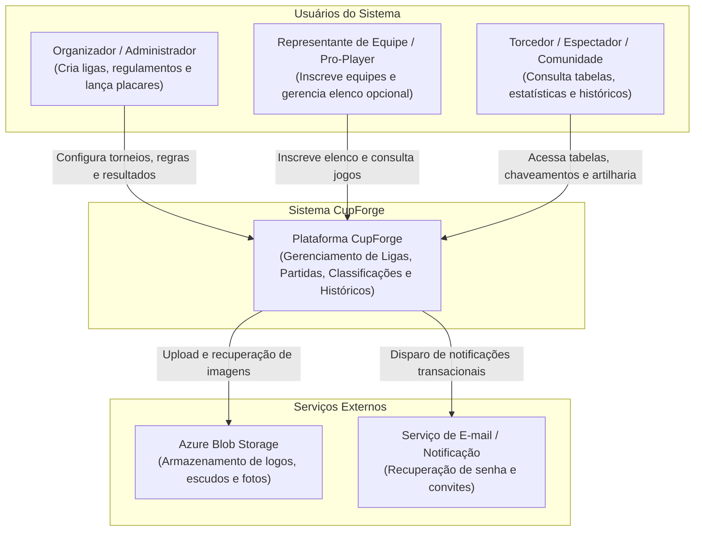
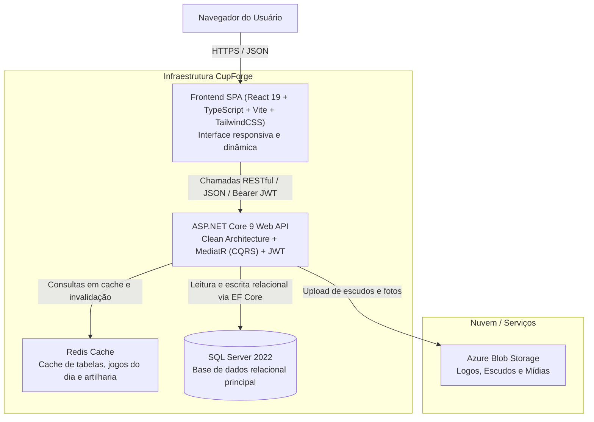
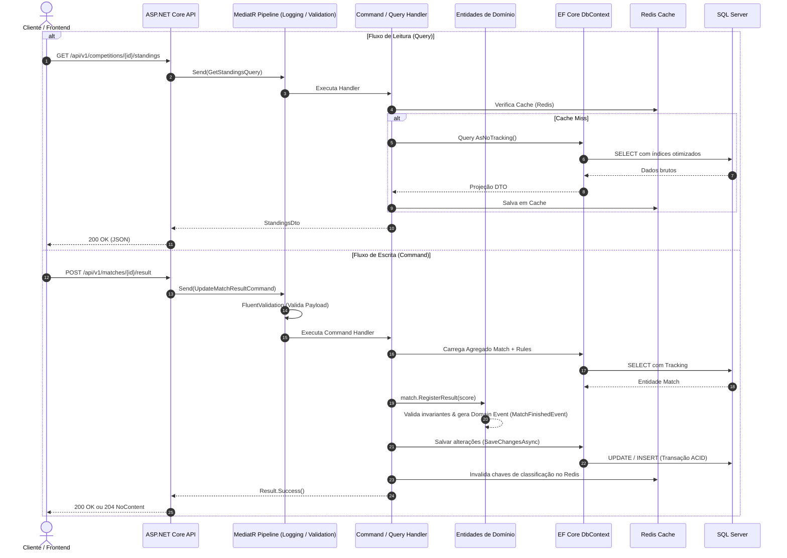

# 🏛️ Arquitetura do Sistema - CupForge

**Versão:** 1.0  
**Data:** Outubro de 2026  
**Status:** Aprovado  
**Autor:** Felipe Batista de Assis  

---

## 1. Visão Geral e Princípios Arquiteturais

O **CupForge** foi projetado seguindo as melhores práticas de Engenharia de Software Moderna para aplicações corporativas com alta flexibilidade de domínio, manutenibilidade a longo prazo e desacoplamento.

### Princípios Chave:
- **Separação de Preocupações (SoC):** Cada camada possui responsabilidade estrita, com o Domínio no centro sem dependências externas.
- **Isolamento de Regras de Domínio:** Entidades ricas e Value Objects encapsulam o estado e a validação das regras esportivas.
- **CQRS (Command Query Responsibility Segregation):** Segregação limpa entre operações de escrita (Commands que alteram estado e disparam eventos) e operações de leitura (Queries focadas em performance e projeção de dados).
- **Event-Driven Interno:** Disparo de Domain Events para desacoplar efeitos colaterais (ex: término de uma partida dispara o recálculo assíncrono da tabela de classificação e artilharia).
- **Observabilidade Nativa:** Telemetria com OpenTelemetry, métricas de saúde (Health Checks) e logs estruturados em JSON via Serilog.

---

## 2. Modelo C4 - Diagramas de Arquitetura

### 2.1 Nível 1: Diagrama de Contexto de Sistema (Context Diagram)

O diagrama de contexto descreve como o **CupForge** interage com usuários humanos e sistemas externos.

---

### 2.2 Nível 2: Diagrama de Contêineres (Container Diagram)

O diagrama de contêineres detalha os componentes de software de alto nível executáveis no ecossistema CupForge.

---

## 3. Visão Geral da Pilha Tecnológica (Tech Stack)

| Componente | Tecnologia Escolhida | Justificativa Técnica |
| :--- | :--- | :--- |
| **Linguagem Backend** | C# 13 / .NET 9 | Plataforma de altíssima performance, recursos modernos (`nullables`, `records`, `primary constructors`). |
| **Framework Web** | ASP.NET Core 9 | Minimal APIs e Controllers com injeção de dependência nativa e middleware robusto. |
| **Mediação & CQRS** | MediatR | Desacoplamento entre endpoints HTTP e lógica de negócio de aplicação. |
| **ORM & Dados** | Entity Framework Core 9 | Mapeamento relacional avançado, migrações fortemente tipadas e suporte a Query Filters globais (Soft Delete). |
| **Banco de Dados** | Microsoft SQL Server 2022 | RDBMS robusto, ACID, com suporte pleno a índices filtrados e alta integridade referencial. |
| **Cache Distribuído** | Redis | Redução de latência para consultas frequentes de classificação pública (p95 < 100ms). |
| **Frontend** | React 19 + TypeScript + Vite | SPA rápido, tipagem estrita de ponta a ponta, componentização moderna com TailwindCSS e Radix/shadcn. |
| **Observabilidade** | Serilog + OpenTelemetry | Rastreabilidade distribuída, logs estruturados e métricas padronizadas. |
| **Containerização** | Docker & Docker Compose | Reprodutibilidade de ambiente local e prontidão para orquestração em nuvem (Azure Container Apps). |
| **Testes** | xUnit + FluentAssertions + Testcontainers | Testes de unidade sem dependências e testes de integração com instâncias reais de SQL Server em contêiner. |

---

## 4. Estratégia de Comunicação e Fluxo de Dados (CQRS)

