# 🧩 Domain-Driven Design (DDD) & Modelagem de Domínio - CupForge

**Versão:** 1.0  
**Data:** Outubro de 2026  
**Status:** Aprovado  
**Autor:** Felipe Batista de Assis  

---

## 1. Bounded Contexts (Contextos Delimitados)

O **CupForge** é estruturado em três Bounded Contexts principais, garantindo que cada área do sistema possua uma linguagem ubíqua (*Ubiquitous Language*) clara e fronteiras bem definidas:

```mermaid
flowchart LR
    subgraph CoreDomain ["1. Core Domain: Competições & Partidas (Competition Context)"]
        direction TB
        Comp["Competition (Competição)"]
        Ed["Edition (Edição/Temporada)"]
        Stg["Stage (Fase: Grupo ou Mata-Mata)"]
        Mtch["Match (Partida & Placar)"]
        Reg["TournamentRules (Regulamento Flexível)"]
        Std["Standings (Classificação & Critérios)"]
    end

    subgraph OrgContext ["2. Contexto de Participantes & Elencos (Roster Context)"]
        direction TB
        Org["Organization (Liga/Federação)"]
        Part["Participant / Club (Equipe / Clã)"]
        Plyr["Player (Atleta / Pro-Player)"]
        Roster["EditionRoster (Inscrição na Edição)"]
    end

    subgraph IdentityContext ["3. Contexto de Acesso & Identidade (Identity Context)"]
        direction TB
        Usr["User (Usuário)"]
        Role["Role & Permissions"]
        Audit["AuditLog (Trilha de Auditoria)"]
    end

    OrgContext -->|Fornece participantes e atletas para| CoreDomain
    IdentityContext -->|Autentica e autoriza ações em| CoreDomain
    IdentityContext -->|Autentica e autoriza ações em| OrgContext
```

---

## 2. Mapa de Agregados e Entidades (Domain Model)

### 2.1 Agregado: `Competition` (Raiz do Torneio)
- **Aggregate Root:** `Competition`
  - Identificador único (`CompetitionId`).
  - `Name`, `Slug`, `Modality` (Futebol Campo, Futsal, Society, Virtual/eSports 1v1, eSports Pro Clubs).
  - Coleção de `Editions` (ex: "Edição 2026", "Temporada 1").

### 2.2 Agregado: `Edition` (Edição com Regulamento Flexível)
- **Aggregate Root:** `Edition`
  - `EditionId`, `CompetitionId`, `Year`, `StartDate`, `EndDate`, `Status` (Draft, InProgress, Completed).
  - **Value Object: `TournamentRules` (Regulamento Customizado):**
    - `PointSystem`: Pontos por vitória, empate, derrota e W.O.
    - `TieBreakOrder`: Lista ordenada dos critérios de desempate escolhidos pelo usuário.
    - `MatchFormat`: Quantidade de titulares em campo (padrão 11, ajustável para 5, 7, etc.), reservas e substituições.
    - `DisciplinaryRules`: Limite de cartões amarelos para suspensão e regras de anistia/zera.
    - `IsPlayerTrackingEnabled`: Booleano que define se o torneio opera em modo simplificado (apenas clubes/placar) ou com gestão de atletas.
  - Coleção de `Stages` (Fases do Torneio).
  - Coleção de `RegisteredParticipants` (Equipes inscritas na edição).

### 2.3 Agregado: `Stage` & `Group` (Fases e Chaveamentos)
- Uma edição é composta por uma ou mais fases sequenciais:
  - **Tipos de Fase:** `RoundRobin` (Grupos / Pontos Corridos) ou `Knockout` (Mata-Mata).
  - **Propriedades da Fase:** Ordem da fase, formato de confronto (Jogo Único, Ida e Volta, MD3), se há prorrogação/pênaltis.
  - **Entidade `Group` (Fase de Grupos):** Nome do grupo (ex: "Grupo A"), lista de participantes do grupo.

### 2.4 Agregado: `Match` (Partida e Eventos)
- **Aggregate Root:** `Match`
  - `MatchId`, `EditionId`, `StageId`, `GroupId` (opcional).
  - `HomeParticipantId` e `AwayParticipantId`.
  - `RoundNumber` (Número da rodada).
  - `ScheduledAt` (Data e hora do jogo).
  - `VenueOrPlatform` (Campo, arena física ou console/servidor virtual).
  - `Status`: `Scheduled`, `InProgress`, `Finished`, `Postponed`, `Cancelled`.
  - **Value Object: `MatchScore`:**
    - `HomeGoals`, `AwayGoals`.
    - `HomePenaltyGoals`, `AwayPenaltyGoals` (se aplicável).
    - `IsWalkover` (W.O.).
  - **Coleção de `MatchEvents` (Opcional quando habilitado):**
    - `GoalEvent`: Minuto, `PlayerId`, `IsOwnGoal`, `IsPenalty`.
    - `CardEvent`: Minuto, `PlayerId`, `CardType` (Amarelo, Vermelho Direto, Segundo Amarelo, Azul).
  - **Métodos de Negócio Ricos:**
    - `Schedule(dateTime, venue)`
    - `RecordResult(score)`
    - `AddGoal(minute, playerId, isOwnGoal)`
    - `AddCard(minute, playerId, cardType)`
    - `RectifyResult(newScore)` -> Dispara `MatchScoreRectifiedDomainEvent`

### 2.5 Agregado: `Participant` / `Club` (Equipe ou Clã)
- **Aggregate Root:** `Participant`
  - `ParticipantId`, `OrganizationId`.
  - `Name`, `ShortName`, `Acronym` (ex: "FLA", "COR"), `LogoUrl`.
  - `Type`: `RealClub` ou `VirtualTeam`.
  - `HistoricalStats`: Total de jogos disputados, vitórias, títulos acumulados.

### 2.6 Agregado: `Player` (Atleta ou Pro-Player - Opcional)
- **Aggregate Root:** `Player`
  - `PlayerId`.
  - `FullName`, `Nickname` / `DisplayName`.
  - `BirthDate`, `Nationality`.
  - **Value Object: `GamerProfile` (Para eSports):** `Gamertag`, `PlatformId` (PSN, Xbox Live, EA ID, Discord).
  - Coleção de `ClubHistories`: Histórico de passagens pelas equipes.

---

## 3. Domain Events (Eventos de Domínio)

Os Domain Events garantem que mudanças no estado de uma partida reflitam de maneira desacoplada nas tabelas de classificação e histórico:

| Domain Event | Quando é disparado? | O que desencadeia? (Handlers) |
| :--- | :--- | :--- |
| **`MatchFinishedDomainEvent`** | Quando uma partida é marcada como `Finished`. | Recalcula a tabela de classificação do grupo/fase; atualiza artilharia da edição; invalida cache do Redis. |
| **`MatchScoreRectifiedDomainEvent`** | Quando o organizador retifica o placar de um jogo já encerrado. | Reprocessa as pontuações e saldo de gols das equipes na tabela da fase. |
| **`StageCompletedDomainEvent`** | Quando a última partida de uma fase é finalizada. | Aplica critérios de desempate finais; qualifica os melhores colocados para a próxima fase (se houver mata-mata). |
| **`PlayerCardReceivedDomainEvent`** | Quando um cartão é lançado para um atleta. | Atualiza a contagem disciplinar acumulada do atleta; verifica e gera pendência de suspensão automática se atingir o limite configurado. |
