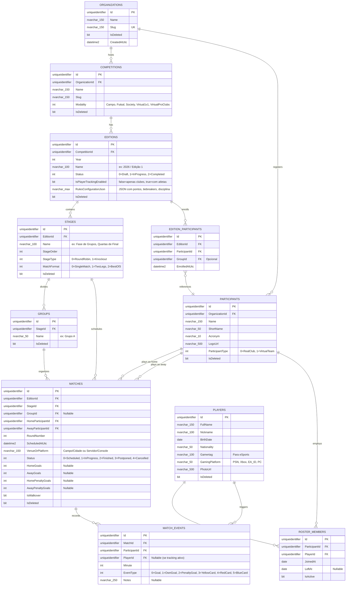

# 🗄️ Modelagem de Banco de Dados (ERD) - CupForge

**Versão:** 1.0  
**Data:** Outubro de 2026  
**Banco Alvo:** Microsoft SQL Server 2022  
**Status:** Aprovado  
**Autor:** Felipe Batista de Assis  

---

## 1. Visão Geral do Modelo de Dados

O modelo de dados do **CupForge** foi projetado para:
- Atender com fidelidade à modelagem DDD com entidades ricas;
- Garantir integridade referencial estrita e conformidade ACID;
- Oferecer suporte nativo a **Soft Delete** (`IsDeleted` + Query Filters no EF Core);
- Suportar **Auditoria Global** (`CreatedAtUtc`, `CreatedBy`, `LastModifiedAtUtc`, `LastModifiedBy`);
- Otimizar buscas e agregações de tabelas com **índices compostos e filtrados** (`Filtered Indexes`).

---

## 2. Diagrama Entidade-Relacionamento (ERD)



---

## 3. Estratégia de Armazenamento do Regulamento Flexível

Para garantir que o **CupForge** ofereça **100% de flexibilidade ao usuário** sem necessidade de alterar o esquema do banco a cada nova regra esportiva, o agregado `Edition` armazena as configurações de regulamento na coluna `RulesConfigurationJson` mapeada para um Value Object fortemente tipado no C#:

```json
{
  "points": {
    "win": 3,
    "draw": 1,
    "loss": 0,
    "walkoverWin": 3,
    "walkoverLoss": 0,
    "walkoverScoreHome": 3,
    "walkoverScoreAway": 0
  },
  "tieBreakerOrder": [
    "Points",
    "Wins",
    "GoalDifference",
    "GoalsScored",
    "HeadToHeadMiniTournament",
    "HeadToHeadGoalDifference",
    "FewestRedCards",
    "FewestYellowCards",
    "OfficialLottery"
  ],
  "matchRules": {
    "startersCount": 11,
    "maxSubstitutes": 12,
    "maxSubstitutions": 5,
    "maxSubstitutionWindows": 3,
    "allowReentry": false,
    "extraTimeSubstitutions": 1
  },
  "disciplinary": {
    "yellowCardsLimitForSuspension": 3,
    "redCardSuspensionMatches": 1,
    "resetYellowCardsAfterGroupStage": true
  }
}
```

> **Vantagem Técnica:** O SQL Server 2022 oferece funções nativas de alta performance para JSON (`JSON_VALUE`, `JSON_QUERY`), permitindo consultas indexadas sobre essas propriedades caso necessário, mantendo o domínio C# totalmente tipado com `System.Text.Json`.

---

## 4. Índices de Alta Performance Recomendados

Para atingir a meta do **RNF-004** (p95 < 100ms em consultas de partidas e tabelas):

1. **`IX_Matches_Edition_Stage_Status`**:
   `CREATE NONCLUSTERED INDEX IX_Matches_Edition_Stage ON Matches (EditionId, StageId, Status) INCLUDE (HomeParticipantId, AwayParticipantId, HomeGoals, AwayGoals, ScheduledAtUtc) WHERE IsDeleted = 0;`
2. **`IX_MatchEvents_MatchId`**:
   `CREATE NONCLUSTERED INDEX IX_MatchEvents_MatchId ON MatchEvents (MatchId) INCLUDE (ParticipantId, PlayerId, EventType, Minute);`
3. **`IX_EditionParticipants_Edition_Group`**:
   `CREATE NONCLUSTERED INDEX IX_EditionParticipants_Edition_Group ON EditionParticipants (EditionId, GroupId);`
